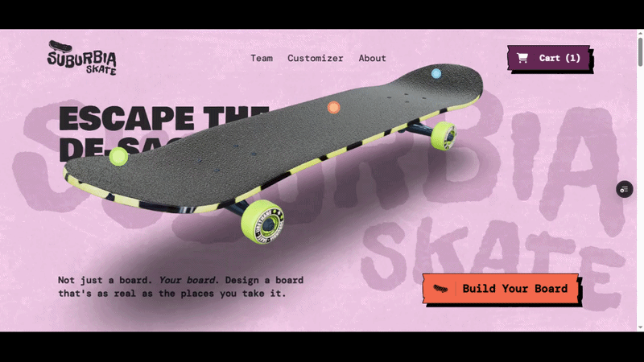

<div id="top"></div>

[![Forks][forks-shield]][forks-url]
[![Stargazers][stars-shield]][stars-url]
[![Issues][issues-shield]][issues-url]
[![MIT License][license-shield]][license-url]
[![LinkedIn][linkedin-shield]][linkedin-url]

<br />
<div align="center">
  <a href="https://github.com/mars01hash/suburbia-skate">
    
  </a>

  <h3 align="center">Suburbia Skateboards</h3>

  <p align="center">
    An immersive 3D skateboard landing page built with Next.js, Three.js, and GSAP
    <br />
    <a href="https://3d-landing-page-plum.vercel.app"><strong>View Live Site »</strong></a>
    &nbsp;·&nbsp;
    <a href="https://github.com/mars01hash/suburbia-skate"><strong>Explore the docs »</strong></a>
    <br />
    <br />
    <a href="https://github.com/mars01hash/suburbia-skate/issues">Report Bug</a>
    ·
    <a href="https://github.com/mars01hash/suburbia-skate/issues">Request Feature</a>
  </p>
</div>

---

<details>
  <summary>Table of Contents</summary>
  <ol>
    <li><a href="#preview">Preview</a></li>
    <li><a href="#video-demo">Video Demo</a></li>
    <li>
      <a href="#about-the-project">About The Project</a>
      <ul>
        <li><a href="#built-with">Built With</a></li>
      </ul>
    </li>
    <li>
      <a href="#getting-started">Getting Started</a>
      <ul>
        <li><a href="#prerequisites">Prerequisites</a></li>
        <li><a href="#installation">Installation</a></li>
      </ul>
    </li>
    <li><a href="#contributing">Contributing</a></li>
    <li><a href="#license">License</a></li>
    <li><a href="#contact">Contact</a></li>
    <li><a href="#acknowledgments">Acknowledgments</a></li>
  </ol>
</details>

---

## Preview

> Animated walkthrough of the landing page experience

<div align="center">
  
</div>

<p align="right"><a href="#top">back to top</a></p>

---

## Video Demo

> Watch the full demo on YouTube for a complete walkthrough

<div align="center">
  <a href="https://youtu.be/K0-ajKViBWg">
    
  </a>
  <br />
  <a href="https://youtu.be/K0-ajKViBWg">▶ Watch on YouTube</a>
</div>

<p align="right"><a href="#top">back to top</a></p>

---

## About The Project

**Suburbia Skateboards** is a high-performance 3D landing page built to deliver an immersive and modern web experience. The project showcases interactive 3D skateboard customization powered by Three.js, smooth scroll-driven animations via GSAP, and content managed through Prismic CMS — all served at blazing speed with Next.js.

Key highlights:
- Real-time 3D skateboard rendering with customizable components
- Scroll-triggered GSAP animations for a cinematic feel
- Headless CMS integration via Prismic for easy content updates
- Fully responsive across desktop and mobile

<p align="right"><a href="#top">back to top</a></p>

### Built With

| Technology | Purpose |
|---|---|
| [TypeScript](https://www.typescriptlang.org/) | Type-safe development |
| [Next.js](https://nextjs.org/) | React framework & SSR |
| [Three.js](https://threejs.org/) | 3D rendering |
| [GSAP](https://gsap.com/) | Scroll animations |
| [Tailwind CSS](https://tailwindcss.com/) | Utility-first styling |
| [Prismic](https://prismic.io/) | Headless CMS |

<p align="right"><a href="#top">back to top</a></p>

---

## Getting Started

### Prerequisites

Ensure you have the following installed:
- [Node.js](https://nodejs.org/) (v18 or higher)
- npm (comes with Node.js)

### Installation

1. Clone the repository
   ```bash
   git clone https://github.com/mars01hash/suburbia-skate.git
   ```
2. Navigate to the project directory and install dependencies
   ```bash
   cd suburbia-skate
   npm install
   ```
3. Start the development server
   ```bash
   npm run dev
   ```
4. Open [http://localhost:3000](http://localhost:3000) in your browser

<p align="right"><a href="#top">back to top</a></p>

---

## Contributing

Contributions are what make the open source community such an amazing place to learn, inspire, and create. Any contributions you make are **greatly appreciated**.

1. Fork the Project
2. Create your Feature Branch (`git checkout -b feature/AmazingFeature`)
3. Commit your Changes (`git commit -m 'Add some AmazingFeature'`)
4. Push to the Branch (`git push origin feature/AmazingFeature`)
5. Open a Pull Request

Don't forget to give the project a star if you found it helpful!

<p align="right"><a href="#top">back to top</a></p>

---

## License

Distributed under the MIT License. See `LICENSE.txt` for more information.

<p align="right"><a href="#top">back to top</a></p>

---

## Contact

Live Site: [https://3d-landing-page-plum.vercel.app](https://3d-landing-page-plum.vercel.app)

Project Link: [https://github.com/mars01hash/suburbia-skate](https://github.com/mars01hash/suburbia-skate)

<p align="right"><a href="#top">back to top</a></p>

---

## Acknowledgments

- [Othneildrew](https://github.com/othneildrew/) — README template
- [Tailwind CSS](https://tailwindcss.com) — CSS framework
- [React Icons](https://react-icons.github.io/react-icons/) — Icon library

<p align="right"><a href="#top">back to top</a></p>

[forks-shield]: https://img.shields.io/github/forks/mars01hash/suburbia-skate.svg?style=for-the-badge
[forks-url]: https://github.com/mars01hash/suburbia-skate/network/members
[stars-shield]: https://img.shields.io/github/stars/mars01hash/suburbia-skate.svg?style=for-the-badge
[stars-url]: https://github.com/mars01hash/suburbia-skate/stargazers
[issues-shield]: https://img.shields.io/github/issues/mars01hash/suburbia-skate.svg?style=for-the-badge
[issues-url]: https://github.com/mars01hash/suburbia-skate/issues
[license-shield]: https://img.shields.io/github/license/mars01hash/suburbia-skate.svg?style=for-the-badge
[license-url]: https://github.com/mars01hash/suburbia-skate/blob/master/LICENSE.txt
[linkedin-shield]: https://img.shields.io/badge/-LinkedIn-black.svg?style=for-the-badge&logo=linkedin&colorB=555

